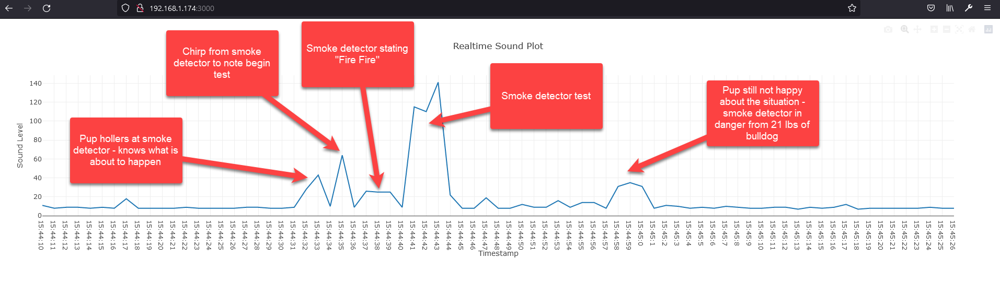

## **IoT Server: Raspberry Pi <-Serial Cable-> Arduino**

---

<p float="left">
   
</p>

---
### Arduino code link below
https://github.com/prichardsondev/Sound-Detector-Arduino.git <br />
    
### Description
Communication between Raspberry Pi and Arduino using Serial Cable <br/>
- Editor used: VS Code with Platformio for Arudino code <br/>
- Raspberry Pi: Nodejs/Express/Socket.io/Plotly <br/>
- Arduino: C++ <br/>
- Serial Communication: Direct Serial Cable

Raspberry Pi Server listens for sound levels and temp sent from Arduino <br/>
over serial cable.

Plotly.com/javascript/ is used to graph sound level on front end [index.html] <br/>
Arduino is sending temp also - I left that up to you

Code is kept simple - no actions are taken based on sound level or temp <br/>

My initial design was to:
- Note smoke detector
  - Kill power to stove
    - https://github.com/prichardsondev/RaspberryPiServer
  - Send me text message
  - Call my loved one
  - Find out smoke detector was being used a cook timer
  - Turn stove back on

---

### Video Overview
[Raspberry Pi Arduino Sound Detection](https://youtu.be/_S649DFFxLA)

---

### File Structure:
Generated on powershell with 'tree /a /f' for fun )
```bash
|   .gitignore
|   app.js
|   package-lock.json
|   package.json
|   README.md
|
\---public
    |   index.html
    |
    \---js
            index.js
```

---

### Hardware:
- Raspberry Pi 3 or 4
- Arduino Uno/other
- DHT 11 temp sensor
- Sparkfun Sound Detector
- Breadboad/Wires
  
---

#### To run:
- cd Sound-Detector-RaspberryPi
- npm install
- connect arduino via serial cable [USB<->UBB]
  - ls /dev/tty*
  - check which port arduino is connected to (end of list)
  - modify serial port in /app.js as necessary - I'm using /dev/ttyUSB0"
    - const port = new SerialPort("/dev/ttyUSB0", {baudRate: 9600});
- npm start
- browse to localhost:3000
- make some noise - watch graph


  


